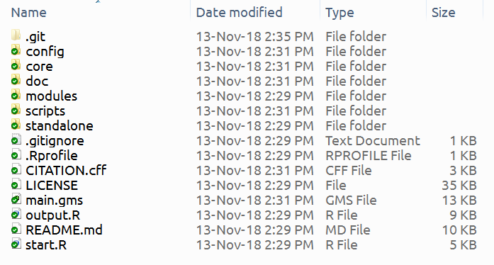

# 1. Introduction

## 1.1. What is configuration 

In computing, configuration files (or config files) are files used to configure the parameters and initial settings for some computer programs. In MAgPIE context, a config file applies the initial settings for the model to run.

Programmers (in our case, a MAgPIE user) may be expected to create and modify config files by hand using a text editor because these are in the end files saved as human-editable plain texts. MAgPIE model reads its configuration file at startup. Users can instruct the model to read the configuration file and apply the changes to the current process.

## 1.2. Relevence to MAgPIE 

Across Unix-like operating systems many different configuration-file formats exist, with each application or service potentially having a unique format, but there is a strong tradition of them being in human-editable plain text. Filename extensions of .cnf, .conf, .cfg, .cf or as well .ini and similar are often used. MAgPIE configuration file has a **.cfg** extension.

MAgPIE 4.0 is designed on a modular model structure. This means that the different *components* of the model interact with each other to act as a complete model. These components are called ***modules*** in MAgPIE terminology. These modules are individual entities and can be thought of as a ***switch(es)*** which can be turned on or off.

## 1.3. Learning objectives

The goal of this exercise is to make changes to the *default* configuration. After completion of this exercise, you'll be able to:

1. Understand how MAgPIE configuration works.
2. Change the title and number of simulation steps for your runs.
3. Select which outputs your model should generate.
4. Run the model with updated configuration.


# 2. Getting started

As stated earlier, MAgPIE configuration (or settings) can be changed by hand using a normal text editor (notepad, notepad++, vim etc.). For this exercise, we will sometimes use R to read in the default configuration file of MAgPIE and understand how it is structured. 

The actual editing to the config file can be done using a text editor by hand. It is expected that the participants of the workshop have already set-up a fork^[**Forking a repository**: https://help.github.com/articles/fork-a-repo/]  from the latest MAgPIE version available on GitHub^[**MAgPIE** repository: https://github.com/magpiemodel/magpie].

The folder where MAgPIE is forked should typically contain the files^[Users may or may not see the **.git** folder in their model folder depending on their *hidden files and folder* toggle.] as in Figure 1.

```{r, echo=FALSE, fig.cap="Contents of a typical MAgPIE fork folder", out.width = '100%',fig.align='center'}

```

# 3. MAgPIE configuration

Users are requested to open a R/RStudio session on their computers and set the MAgPIE fork folder as working directory. This can be done by using the following command:

```{r, eval = FALSE}
setwd("/path/to/your/magpie/fork/folder")
```

or alternatively, 

1. RStudio on windows  : **Ctrl** + **Shift** + **h** then browse to /path/to/your/magpie/fork/folder
2. R on windows        : **File** -> **Change dir...** then browse to /path/to/your/magpie/fork/folder
3. RStudio on mac      : **Session** -> **Set working directory** -> **Choose directory** then browse to /path/to/your/magpie/fork/folder

To make sure that we are in the correct directory, try running this command:
```{r, eval = FALSE}
dir()
```
You should see **"config"** in the directory content from above code. From here on, we can start reading in the *default* configuration file by sourcing it from the **config** folder.

```{r}
source("additional_data/default.cfg")
```

This reads the **deafult.cfg** file located in the config folder of MAgPIE model. The object received from this source command is loaded as an object by the name **"cfg"** in global environment. You can check this by running ls() command. Remember that the object **cfg** is a list. 

We can look at the contents of this list by looking at the names of components. The description of these components can be found in table 1.

```{r comment=NA}
names(cfg)
```

```{r echo = FALSE,results='asis'}
knitr::kable(data.frame(No = 1:length(names(cfg)),
                        Config=names(cfg),
                        Description=
                          c("Model title","Path to the submodel (relative to main model folder)","Input data source",
                            "Repository containing input data","Shuold data be downloaded even if inputs didn't change?",
                            "Yield calibration","Accuracy for yield calibration","Max. iterations if precision goal is not met",
                            "Factor determining new calibration factor's influences on result","Switch for cropland calibration",
                            "Settings for NPI/NDC recalculation", "National or Sub-national mappinng","Module settings", "How runs should be made",
                            "Log information","Generation of output files","Results folder name","Files copied to output folder","Folder run statistics location",
                            "Name of the overall model","Model version","Developer mode","Debugging mode"),
                        Focus=c("x","","","","","","","","","","","","x","","","x","","","","","","","")
                        ),caption = "Description of MAgPIE configuration")
```

MAgPIE is modular in structure and the various modules can be seen in the **gms** section of the **cfg** list. We'll now try to extract all the names of modules defined in the config file.

```{r comment=NA,eval=FALSE}
names(cfg$gms)[!grepl("\\d",names(cfg$gms))]
```

MAgPIE modules can be turned on to a given module realization or can be turned off completely. More information is available in the corresponding descriptions of the **default.cfg** file.

# 4. Exercises

Let us try to see what is the default title of MAgPIE runs. This can be accessed by using:

```{r comment=NA,eval=FALSE}
cfg$title
```

As you can see, the model is titled *`r cfg$title`* for obvious reasons. Usually the **title** setting helps in creating the name of the **results** folder inside the **output** folder of the model.

```{r comment=NA,eval=FALSE}
cfg$results_folder
```

*`r cfg$results_folder`* tells us that the result folder is created automatically as a combination of **model title** name and the **current date**. Usually you can use any character string for the results folder name but it is important to remember that the model execution stops if a result folder by the same name exists.

## 4.1. Changing the title

The title for the model run can be done by opening the **default.cfg** file located inside the config folder of your MAgPIE fork^[This process can also be automatised by using a start script.] by using a text editor. Follwing should be the default config content. 

```{r, eval = FALSE}
cfg$title <- "default"
``` 

Users are requested to change the title as a combination of their **affiliation** and **initials** within the quotations and save the file after editing.
```{r, eval = FALSE}
cfg$title <- "<affiliation>_<initials>_mag4workshop"
``` 

For example:
```{r, eval = FALSE}
cfg$title <- "PIK_AM_mag4workshop"
``` 

## 4.2. Changing the time step

MAgPIE, being a recursive dynamic model, can run with various levels of time steps. These time steps are usually in five year time intervals but you can also run it with ten year time steps. A full set of **time-step** settings^[The time step settings are within the **gms** component of the **cfg** list.] can be found in the core sets defined in the model code under **core/sets.gms**. Similar description of available time set settings are available in the **default.cfg** file. 

In this exercise, we'll try to set the time-step settings to **5** which corresponds to the years **y1995, y2000, y2010, y2020 and y2030**. Note that MAgPIE 4.0 starts simlations in y1995. To see the current default time-steps, try running the following command in your R console:

```{r, warning=FALSE, comment=NA,eval=FALSE}
cfg$gms$c_timesteps
``` 
*`r cfg$gms$c_timesteps`* refers to time steps y1995, y2000, y2005, y2010,y2015, y2020, y2025, y2030, y2035, y2040, y2045, y2050, y2055, y2060, y2070, y2080, y2090 and y2100. 

Similar to how we updated the title, you can simply delete *`r cfg$gms$c_timesteps`* from the line containing

```{r, warning=FALSE, eval=FALSE}
cfg$gms$c_timesteps <- "coup2100"
``` 

and set it to 

```{r, warning=FALSE, eval=FALSE}
cfg$gms$c_timesteps <- 5
``` 

## 4.3. Changing the ouputs

MAgPIE is also capable of generating some stylized outputs which can be created automatically once the model run is finished. These ouputs^[Complete list of output scripts can be seen in **scripts/output/single** or **scripts/output/comparison** folders.] can be based on **single** run of the model or can also be **comparative** in nature where the comparison is made between two or more runs. 

The default MAgPIE configuration runs *rds_report* (to be used in appMAgPIE), *validation* (as a pdf) and *interpolation* scripts after the model run is finished. Usually, the creation of validation pdf takes quite some time. 

In this exercise, we'll exclude the creation of validation pdf due to time constraints. To do so, you can replace

```{r, warning=FALSE, eval=FALSE}
cfg$output <- c("rds_report","validation","interpolation")
``` 

with

```{r, warning=FALSE, eval=FALSE}
cfg$output <- c("rds_report","interpolation")
``` 

## 4.4. Running the model with updated configuration

So far, we have successfully changed:

1. Title of MAgPIE runs
2. Time steps of simulation
3. Outputs desired

Now, Lets try to run the model with this updated configuration. To do so, windows users can go to the forked branch folder of MAgPIE and open a command line prompt there. For windows users, this can be done using **shift** + **right click** then selecting *open command window here* option.

In the command prompt, use the following command:
```{r, eval = FALSE}
Rscript start.R
``` 

You'll now see a bunch of R scripts on your command prompt, based on which the model can be run. 

We are only focusing on the default script at the moment^[Complete list of starting R scripts can also be found in the **scripts**/**start** folder.] which was changed by us during the course of this exercise. 

Select option 1 (***default***) and then option 1 again (***Direct execution***). 

This will start^[To stop a run you can use the key combination **ctrl** + **c** on windows machines.] the model run on your local machine.

