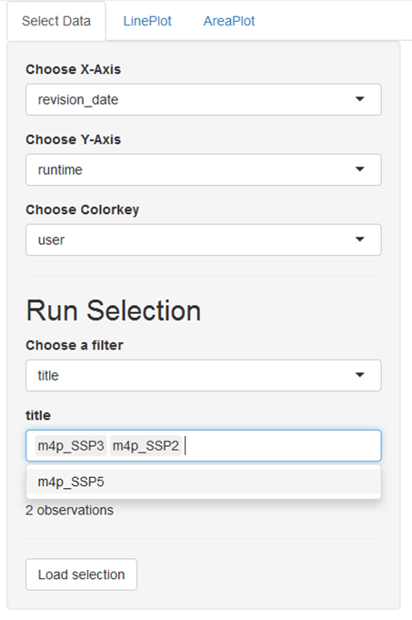
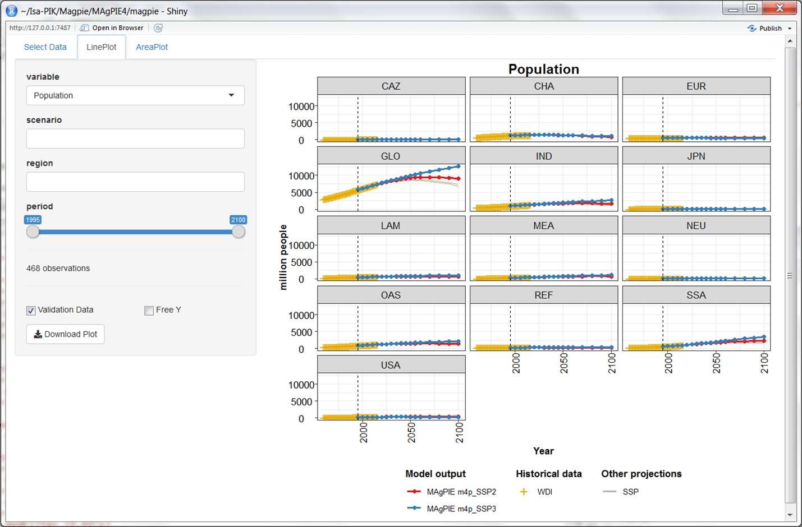

# 1. Introduction

### 1.1. Output analysis

After having succesfully started and accomplished a simualtion run, the next step is to evaulate the simulation results.
There are several ways to assess and evaluate MAgPIE results. This tutorial gives an overview on different tools and options that can be used to analyse model outputs. 

For each simulation, results are written to a folder that is created automatically as a combination of **model title** name and the **current date** inside the **output** folder of the model.


### 1.2. Learning objectives
The goal of this exercise is to use several tools for output analysis. After completion of this exercise, you'll be able to:

1. Use **model-internal R-scripts** for output analysis.
2. Know where to find the **automated validation pdf** and how it is structured.
3. Use the evaluation tool **appMAgPIElocal** of the library **shinyresults**.
4. Use the **magpie4 library** for output analysis.
5. Analysize outputs with the **gdx library**.


# 2. Model-internal R-scripts for output analysis

### 2.1. Execution of model-internal output scripts via the MAgPIE configuartion file
In the file "config/default.cfg", it is possible to indicate which R-scripts are executed for output analysis, after a model run is finished. Scripts evaluating single runs are stored in the folder **scripts/output/single**, while the folder **scripts/output/comparison** contains scripts that compare model output across several runs. In the default MAgPIE configuration, the scripts *rds_report* (to be used in appMAgPIE; see explanations below), *validation* and *interpolation* are selected via cfg$output: 


`cfg$output <- c("rds_report","validation","interpolation")`

### 2.2. Execution of model-internal output scripts in the command window
Output scripts that are included in the folders **scripts/output/single** and **scripts/output/comparison** can also be executed via command window. To do so, windows users can open a command line prompt in the MAgPIE model folder by using **shift** + **right click** and then selecting *open command window here* option.

In the command prompt, use the following command:
```{r, eval = FALSE}
Rscript output.R
``` 

You are now asked to choose the output mode:
1: Output for single run
2: Comparison across runs

```{r, echo=FALSE, fig.cap="Executing output scripts via command window", out.width = '30%',fig.align='center'}
knitr::include_graphics("figures/Rscript_outputR.png")
```

In both cases, you can choose from the list of available model simulations, for which runs you want to conduct the model output analysis: 

In the next step, you can interactively indicate which output function you want to execute.

# 2. Automated model validation
If the validation script is executed, a standard evaluation pdf is created that validates numerous model outputs with a validation database containing historical data and projections for most outputs returned by the model, either visually or via statistical tests. A standard evaluation PDF consists of hundreds of evaluation outputs and usually has a length of around 1800 pages. By evaluating the model outputs on such a broad level rather than focusing only key outputs it allows to get a more complete picture of the corresponding simulation. 

However, comparison between model runs, i.e. between different scenarios, is rather difficult and inconvenient if the model results are scattered across different large PDF files. 

# 3. Interactive scenario analysis
To overcome this issue, we developed the interactive scenario analysis and evaluation tools appMAgPIE and appMAgPIElocal as part of the library *shinyresults* (https://github.com/pik-piam/shinyresults), which show evaluation plots for multiple scenarios including historical data and other projections based on an interactive selection of regions and variables. You can use this tool by running the following R command in the main folder of your model, which will automatically collect all runs in the output folder and visualize them: 

```{r comment=NA,eval=FALSE}
shinyresults::appMAgPIElocal()
```


This command opens an interactive window, where you can select the simulations that you want to evaluate. 


```{r, echo=FALSE, fig.cap="Interactive MAgPIE app", out.width = '70%',fig.align='center'}
knitr::include_graphics("figures/appMAgPIE_window.png")
```


You can use filters to select a subset of all runs stored in the output folder of the model, for example by searching for runs that have been finished at a certain day or by searching for keywords in the title of the simualtion runs:


```{r, echo=FALSE, fig.cap="Run selection by using a filter", out.width = '30%',fig.align='center'}
knitr::include_graphics("figures/appMAgPIE_runselection.png")
```


## 3.1. Excercise

Choose *title* as filter and select the SSP2 and SSP3 simulations:


```{r, echo=FALSE, fig.cap="How to use the title for filtering runs", out.width = '30%',fig.align='center'}

```


After having selected the subset of runs that you want to analyze, click the button *Load selection*. Now, you can click on the tab *LinePLot*. You will then see on the right hand side line plots showing the development of population for historical and future time steps for all model regions and on the global scale:


```{r, echo=FALSE, fig.cap="Regional and global development of population", out.width = '70%',fig.align='center'}

```


```{r, echo=FALSE, fig.cap="Selection of variables for line plots", out.width = '30%',fig.align='center'}
knitr::include_graphics("figures/appMAgPIE_LinePlot_variables.png")
```


# 4. Analysis of outputs with the magpie4 library

If you want to go beyond visual output analysis and predefined output evaluation facilited by scripts in the model folders **scripts/output/single** and **scripts/output/comparison**, you can use the functionality of the R package *magpie4* (https://github.com/pik-piam/magpie4). This library contains a list of common functions for extracting outputs from the MAgPIE model which are also the basis for the generation of thze automated validation pdf.


# 5. Analysis of outputs with the gdx library

